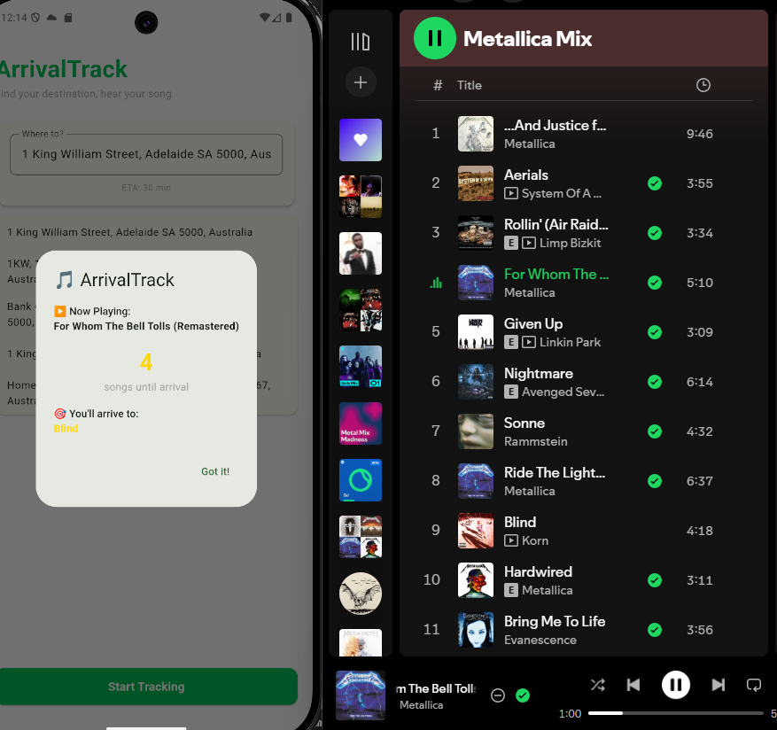

Arrival Track is an iOS/Android app that calculates which song in your Spotify queue will be playing when you reach your destination.

## Table of Contents

1. [How It Works](#how-it-works)
2. [Installation](#installation)
   - 2.1 [Using Prebuilt Packages](#using-prebuilt-packages-recommended)
   - 2.2 [Building from Source](#building-from-source)
3. [Usage](#usage)


## How It Works

1. **Connect Spotify** - Log in with your Spotify account (requires active playback)
2. **Enter Destination** - Type your destination address using autocomplete
3. **Get Your Arrival Track** - The app calculates your ETA and shows which song in your queue will be playing when you arrive
---
## Installation

### Using Prebuilt Packages (Recommended)

**No API keys needed!**

#### Android

1. Go to the [Releases](https://github.com/jenish094/arrival-track/releases) section
2. Download the latest `arrival-track-v{version}.apk` file
3. On your Android device:
   - Enable "Install from Unknown Sources" in Settings → Security
   - Open the downloaded APK file
   - Follow the installation prompts

#### iOS

1. Go to the [Releases](https://github.com/jenish094/arrival-track/releases) section
2. Download the latest `.ipa` file
3. Install using Sideloadly or whatever you have
---

### Building from Source

#### Prerequisites

- [Flutter SDK](https://flutter.dev/docs/get-started/install) (3.0 or higher)
- [Android Studio](https://developer.android.com/studio) (for Android builds)
- [Xcode](https://developer.apple.com/xcode/) (for iOS builds, macOS only)
- [Git](https://git-scm.com/)

#### Required API Keys

You'll need to obtain your own API keys for the following services:

##### 1. Spotify API
- Go to [Spotify Developer Dashboard](https://developer.spotify.com/dashboard)
- Create a new app
- Note your **Client ID**
- Add redirect URI: `arrivaltrack://auth`

##### 2. OpenRouteService API
- Sign up at [OpenRouteService](https://openrouteservice.org/dev/#/signup)
- Free tier: 2,000 requests/day
- Generate an API key from your dashboard

##### 3. Geoapify API
- Sign up at [Geoapify](https://www.geoapify.com/)
- Free tier: Idk i didnt bother checking
- Get an API key for Autofill

#### Build Instructions

1. **Clone the repository**
   ```bash
   git clone https://github.com/jenish094/arrival-track.git
   cd arrival-track
   ```

2. **Navigate to Flutter project**
   ```bash
   cd arrival_track_flutter
   ```

3. **Install dependencies**
   ```bash
   flutter pub get
   ```

4. **Configure API keys**
   
   Create a `.env` file in the `arrival_track_flutter` directory:
   ```bash
   # arrival_track_flutter/.env
   SPOTIFY_CLIENT_ID=client_id
   SPOTIFY_REDIRECT_URI=arrivaltrack://auth
   OPENROUTE_API_KEY=ORS Api key
   AUTOCOMPLETE_API_KEY=geoapfy key
   ```

5. **Build the app**

   **For Android:**
   ```bash
   # Debug build
   flutter build apk --debug
   
   # Release build (requires signing)
   flutter build apk --release
   ```
   Output: `build/app/outputs/flutter-apk/app-release.apk`

   **For iOS:**
   ```bash
   # Debug build
   flutter build ios --debug
   
   # Release build
   flutter build ios --release
   ```
   Then open `ios/Runner.xcworkspace` in Xcode to archive and sign.

6. **Run on device/emulator**
   ```bash
   flutter run
   ```

---

## Usage

### First Time Setup

1. **Launch the app**
2. **Connect Spotify**
   - Tap "Connect to Spotify"
   - Log in with your Spotify credentials
   - Grant the requested permissions
3. **Start playing music** on Spotify (the app needs an active queue)

### Calculate Your Arrival Track

1. **Enter your destination** in the search box
   - Use the autocomplete suggestions
   - Or type the full address
2. **Tap "Start Tracking"**
3. The app will show:
   - Your calculated ETA
   - The song that will be playing when you arrive


## Acknowledgments

- **Spotify** for the Web API
- **OpenRouteService** for routing and geocoding
- **Geoapify** for address autocomplete
- **Flutter** team for the amazing framework

---

## IMAGE


